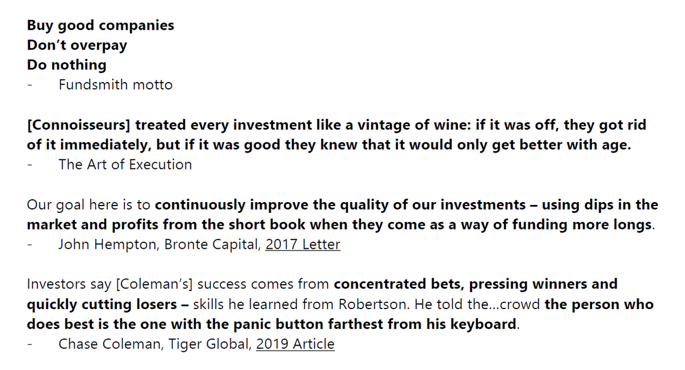

# Investing

Investing advice that works  
📗Read Widely  
👨‍🏫Study Great Investors  
✍️Journal  
🔂Trade Less  
📈Add To Winners  
⏳Wait longer

Only bet when the odds are substantially in your favor. Don’t bet unless you have a margin of safety. If you are not feeling certain and comfortable with your bet, then don’t bet. Put differently by Charlie Munger: “the wise ones bet heavily when the world offers them that opportunity. They bet big when they have the odds. And the rest of the time they don’t. It is just that simple.

